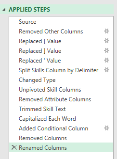
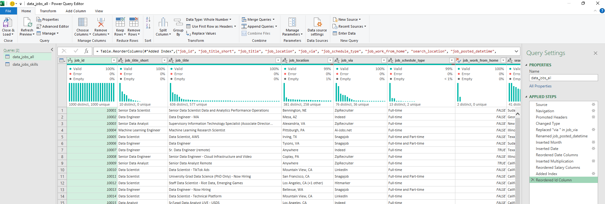
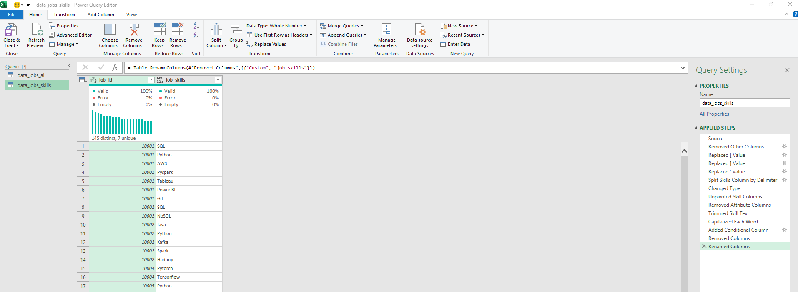

<a name="top"></a>

# 📊 Excel Salary Dashboard

**Dataset:** 2023 real-world data jobs — salaries, titles, countries, schedule types, platforms, skills.
**Goal:** Interactive dashboard — pick a role, country, and schedule type → get median salary, job count, top platform.

---

## 📋 Table of Contents

- [Section 1 — Excel Formula Reference](#section-1--excel-formula-reference)
- [Section 2 — How I Built the File](#section-2--how-i-built-the-file)
- [Section 3 — Dashboard Documentation](#section-3--dashboard-documentation)
- [Section 4 — Excel Advanced Features](#section-4--excel-advanced-features)
- [Section 5 — Power Query Build Process](#section-5--power-query-build-process)
- [Section 6 — Project Documentation](#section-6--project-documentation)

---

---

# SECTION 1 — Excel Formula Reference

> Basic Excel formulas with simple, practical examples — useful as a quick reference or learning guide.

---

## Statistical

| Formula | What it does | Example |
|---|---|---|
| `MIN()` | Smallest value | `=MIN(jobs[salary_year_avg])` → lowest salary in dataset |
| `MAX()` | Largest value | `=MAX(jobs[salary_year_avg])` → highest salary |
| `MEDIAN()` | Middle value (outlier-resistant) | `=MEDIAN(jobs[salary_year_avg])` → $115,000 |
| `AVERAGE()` | Mean value | `=AVERAGE(jobs[salary_year_avg])` → compare to median to detect skew |
| `STDEV.P()` | Std dev — whole population | `=STDEV.P(jobs[salary_year_avg])` → spread across all postings |
| `STDEV.S()` | Std dev — sample | `=STDEV.S(jobs[salary_year_avg])` → slightly larger, use when data is a sample |
| `SUM()` | Total | `=SUM(jobs[salary_year_avg])` |
| `COUNT()` | Count numeric values only | `=COUNT(jobs[salary_year_avg])` → rows that have a salary |
| `COUNTA()` | Count non-blank (includes text) | `=COUNTA(jobs[job_title_short])` → total job postings |
| `MODE()` | Most frequent value | `=MODE(jobs[salary_year_avg])` → most common salary data point |

> ⚡ **STDEV.P vs S** — use `.P` when your data is the full population; `.S` when it's a sample. For this dataset (all 2023 postings), `.P` is correct.

---

## Counting & Conditions

```excel
-- COUNTIF — single condition
=COUNTIF(jobs[job_title_short], "Data Analyst")        -- all DA postings
=COUNTIF(jobs[salary_year_avg], "<>")                  -- rows with any salary

-- COUNTIFS — multiple conditions simultaneously
=COUNTIFS(
  jobs[job_title_short],   "Data Analyst",
  jobs[job_country],       "United States",
  jobs[salary_year_avg],   "<>"
)
-- Count US Data Analyst postings that have salary data

-- SUMPRODUCT — flexible array counting
=SUMPRODUCT(
  (jobs[job_title_short]="Data Analyst") *
  (jobs[job_country]="United States")
)
-- Same result as COUNTIFS but works with complex array expressions
```

---

## Logical

```excel
-- IF — basic condition
=IF(jobs[@salary_year_avg] > 100000, "High", "Standard")
=IF(jobs[@job_work_from_home] = TRUE, "Remote", "On-site")

-- IFS — multiple conditions, no nesting needed
=IFS(
  jobs[@salary_year_avg] >= 150000, "Senior pay",
  jobs[@salary_year_avg] >= 100000, "Mid pay",
  jobs[@salary_year_avg] >= 70000,  "Entry pay",
  TRUE, "Below market"              -- TRUE = catch-all (else)
)

-- IFERROR — handle errors gracefully
=IFERROR(XLOOKUP(A2, $D$2:$D$11, $E$2:$E$11), "No data")
-- shows "No data" instead of #N/A when lookup finds nothing

-- Array AND vs OR (inside MEDIAN/IF or SUMPRODUCT):
=(jobs[job_title_short]="Data Analyst") * (jobs[salary_year_avg]<>0)  -- AND: both TRUE = 1
=(jobs[job_title_short]="Data Analyst") + (jobs[job_work_from_home]=TRUE) -- OR: either TRUE ≥ 1
```

---

## Lookup & Reference

```excel
-- XLOOKUP — modern, flexible (Excel 365)
=XLOOKUP(
  lookup_value,      -- what to find
  lookup_array,      -- where to look
  return_array,      -- what to return
  "No Result"        -- if not found (optional)
)
-- Example: get median salary for selected title
=XLOOKUP(title, $D$2:$D$11, $E$2:$E$11, "No Result")

-- VLOOKUP — legacy (return column must be to the RIGHT of lookup column)
=VLOOKUP(title, $C$2:$E$11, 2, FALSE)
--                           ^  = column index: return 2nd column of range
--                              FALSE = exact match

-- HLOOKUP — searches across rows instead of down columns
=HLOOKUP("salary_year_avg", jobs[#Headers], 2, FALSE)

-- MATCH — returns position number (not value)
=MATCH(title, $C$2:$C$11, 0)           -- 0 = exact match
=IFERROR(MATCH(title, $C$2:$C$11, 0), "Not found")
-- useful for checking if a value exists
```

---

## Dynamic Arrays *(Excel 365)*

```excel
-- UNIQUE — returns distinct values, spills down automatically
=UNIQUE(jobs[job_title_short])          -- list of all unique job titles
=UNIQUE(jobs[job_country])              -- list of all unique countries

-- SORT — sorts a range or array
=SORT(A2:B11, 2, -1)        -- sort by column 2, descending (-1) | ascending (1)
=SORT(UNIQUE(jobs[job_country]))        -- sorted unique list in one step

-- FILTER — returns rows matching a condition
=FILTER(A2:B11, ISNUMBER(B2:B11))      -- keep only rows where B is numeric
=FILTER(
  J2#,                                 -- J2# = entire spill range from J2
  (NOT(ISNUMBER(SEARCH("and", J2#)) + ISNUMBER(SEARCH(",", J2#)))) * (J2# <> 0)
)
-- removes combined schedule types ("Full-time and Part-time") and blanks

-- SEQUENCE — generates a number/date array
=SEQUENCE(12, 1, DATE(2023,1,1), 30)   -- 12 dates starting Jan 1, every 30 days

-- TRANSPOSE — flip rows to columns
=TRANSPOSE(A2:A11)                     -- vertical list → horizontal row
```

---

## Text

```excel
=SUBSTITUTE(C2, "via ", "")            -- remove "via " → "LinkedIn"
=TEXT(A2, "mmmm")                      -- date serial → "January"
=TEXT(A2, "yyyy-mm")                   -- → "2023-01"
=TEXTJOIN(", ", TRUE, A2:A10)          -- join values with comma separator
=TEXTSPLIT(A2, ", ")                   -- "sql, python" → sql | python
=RIGHT(A2, LEN(A2) - FIND(" ", A2))   -- everything after first space
=FIND("via ", A2)                      -- position of "via " (case-sensitive)
=MID(A2, 3, LEN(A2) - 4)              -- extract middle (strip outer brackets)
=ISNUMBER(SEARCH("python", A2))        -- TRUE if "python" appears anywhere (case-insensitive)
```

---

## Date & Time

```excel
=MONTH(A2)          -- 1–12
=DAY(A2)            -- 1–31
=YEAR(A2)           -- 2023
=DATE(2023, 1, 1)   -- construct a date from parts
=TODAY()            -- current date (recalculates on open)
=TODAY() - A2       -- days since posting

=DATEDIF(A2, TODAY(), "D")   -- days between two dates
=DATEDIF(A2, TODAY(), "M")   -- complete months
=DATEDIF(A2, TODAY(), "Y")   -- complete years

=HOUR(A2)      =MINUTE(A2)      =SECOND(A2)
=TIME(9, 0, 0)  -- constructs 9:00:00 AM as a decimal fraction

-- Count postings by month name (e.g. V2 = "January"):
=SUMPRODUCT(--(TEXT(jobs[job_posted_date], "mmmm") = V2))
-- TEXT converts serial dates → month names | -- converts TRUE/FALSE → 1/0
```

---

## Aggregation

```excel
-- SUBTOTAL — respects AutoFilter (ignores hidden rows)
=SUBTOTAL(9, jobs[salary_year_avg])     -- 9 = SUM of visible rows only
=SUBTOTAL(1, jobs[salary_year_avg])     -- 1 = AVERAGE of visible rows
-- Keys: 1=AVG, 2=COUNT, 3=COUNTA, 4=MAX, 5=MIN, 9=SUM

-- AGGREGATE — like SUBTOTAL but ignores errors too
=AGGREGATE(12, 5, jobs[salary_year_avg])      -- MEDIAN, ignore hidden + errors
=AGGREGATE(15, 6, jobs[salary_year_avg], 1)   -- SMALL (1st smallest), ignore errors
-- Function keys: 12=MEDIAN, 15=SMALL | Option keys: 5=hidden+errors, 6=errors only
```

---

## Charts Reference

| Chart | Best for |
|---|---|
| **Line chart** | Trends over time (posting volume, salary by month) |
| **Pie chart** | Share/proportion (% postings by schedule type) |
| **Column / Bar chart** | Comparing categories (salary by job title) |
| **Scatter plot** | Correlation (salary vs skill count) |
| **Map chart** | Geographic comparison (median salary by country) |
| **Box / Whisker** | Distribution + outliers (salary range per role) |
| **Sparkline** | Mini in-cell trend (quick row-level pattern) |
| **Histogram** | Frequency distribution (how often each salary range occurs) |

**Other Excel features used:**

| Feature | Use |
|---|---|
| **Table** | Structured reference (`jobs[column]`) — auto-expands with new rows |
| **Slicer** | Visual filter buttons connected to PivotTables |
| **Table total row** | Quick aggregate at the bottom of a Table without a formula |
| **Validation sheet** | Separate sheet holding dropdown source lists — keeps dashboard clean |

---

## Job Rank Score

Weighted composite to rank job titles by desirability — demand × salary × remote preference.

```excel
-- Weights: job_count=0.45 | salary=0.30 | WFH=0.15
-- Each factor normalised 0–1 using Min-Max: (value - min) / (max - min)

-- WFH rate for each title (col A = title, result in col D):
=COUNTIFS(jobs[job_title_short],A2,jobs[job_work_from_home],TRUE)
 / COUNTIF(jobs[job_title_short],A2)

-- Full rank score (B=job_count, C=median_salary, D=wfh_rate):
=IFERROR(
  (((B2-MIN($B$2:$B$11))/(MAX($B$2:$B$11)-MIN($B$2:$B$11)))*0.45) +
  (((C2-MIN($C$2:$C$11))/(MAX($C$2:$C$11)-MIN($C$2:$C$11)))*0.30) +
  (((D2-MIN($D$2:$D$11))/(MAX($D$2:$D$11)-MIN($D$2:$D$11)))*0.15),
  0   -- IFERROR handles division by zero (max = min edge case)
)
-- Weights sum to 0.90 — add a 4th factor × 0.10 to reach 1.0
```

[↑ Back to Top](#top)

---

===================================================

# SECTION 2 — How I Built the File

> Step-by-step walkthrough of every sheet and every formula used to build the dashboard.

---

## Workbook Structure

| Sheet | Role |
|---|---|
| `Data` | Raw source — never edit directly |
| `Data_Validation` | Clean dropdown lists for all 3 selectors |
| `Title` | Median salary per job title + bar chart source |
| `Country` | Median salary per country + map chart source |
| `Type` | Median salary per schedule type + bar chart source |
| `Platform` | Job count per platform → Top Platform KPI |
| `Salary_Calculator` | The visible dashboard — 3 KPI cards + 3 charts |

---

## Step 1 — Data Sheet

Convert the raw data range to an Excel Table first — this enables structured references and auto-expansion.

```
Click any cell in the data → Insert → Table → ✅ My table has headers → name it: jobs
```

---

## Step 2 — Name the Three Dashboard Input Cells

> Do this before writing any formula — it makes every formula readable.

```
On the Salary_Calculator sheet:
  Job Title cell   → Formulas → Define Name → title
  Country cell     → Formulas → Define Name → country
  Schedule cell    → Formulas → Define Name → type
```

Now `title`, `country`, `type` can be used in any formula instead of `$C$2`, `$C$3`, `$C$4`.

---

## Step 3 — Data_Validation Sheet

Generates clean, sorted dropdown source lists. Users never see this sheet.

### A — Job Titles

```excel
-- [job_title_short] — all unique titles
-- Cell A2:
=UNIQUE(jobs[job_title_short])

-- [job_title_short_count] — count of matching jobs per title
-- (filtered by selected country + schedule type)
-- Cell B2 (copy down for all titles):
=COUNT(
  IF(
    (jobs[job_title_short] = A2) *
    (jobs[job_country] = country) *
    (ISNUMBER(SEARCH(type, jobs[job_schedule_type]))),
    jobs[salary_year_avg]
  )
)
-- * = AND logic | ISNUMBER(SEARCH()) = partial match for schedule type
-- COUNT ignores FALSE → only counts rows with a salary value

-- [job_title_short_sorted] — sorted by count descending
-- Cell C2:
=SORT(A2:B11, 2, -1)
```

### B — Countries

```excel
-- [job_country] — all unique countries
-- Cell F2:
=UNIQUE(jobs[job_country])

-- [job_country_sorted] — alphabetical
-- Cell G2:
=SORT(F2#)   -- F2# references the entire spill range from F2
```

### C — Schedule Types

```excel
-- [job_schedule_type] — all types (raw, includes combined entries)
-- Cell J2:
=UNIQUE(jobs[job_schedule_type])

-- [job_schedule_type_sorted] — cleaned: remove "and", comma-combined, and blank entries
-- Cell K2:
=FILTER(
  J2#,
  (NOT(ISNUMBER(SEARCH("and", J2#)) + ISNUMBER(SEARCH(",", J2#)))) *
  (J2# <> 0)
)
-- ISNUMBER(SEARCH("and",...)) = TRUE for "Full-time and Part-time" → excluded
-- NOT(...) keeps only clean single-type values
-- * (J2# <> 0) removes blank/zero entries
```

### D — XLOOKUP for Job Count KPI card

```excel
-- Looks up the selected title in the sorted table → returns its count
=XLOOKUP(title, $C$2:$C$11, $D$2:$D$11, "No Results")
-- C = job_title_short_sorted | D = corresponding counts
-- This value feeds the Job Count KPI card on the dashboard
```

---

## Step 4 — Title Sheet

Median salary per job title — also the source for the horizontal bar chart.

```excel
-- [job_title_short] — title list from validation sheet
-- Cell A2:
=Data_Validation!C2:C11

-- [median_salary] — median per title, filtered by country + type
-- Cell B2 (copy down):
=MEDIAN(
  IF(
    (jobs[job_title_short] = A2) *
    (jobs[salary_year_avg] <> 0) *
    (jobs[job_country] = country) *
    (ISNUMBER(SEARCH(type, jobs[job_schedule_type]))),
    jobs[salary_year_avg]
  )
)
-- salary_year_avg <> 0 excludes blank/zero salary rows
-- ISNUMBER(SEARCH()) handles "Full-time" inside "Full-time and Part-time"

-- [job_title_short_salary_sorted] — filter out titles with no data, sort ascending
-- Cell C2 (spills into C and D):
=SORT(FILTER(A2:B11, ISNUMBER(B2:B11)), 2, 1)
-- ISNUMBER removes rows where median returned an error (no matching data)
-- Sort ascending (1) so bar chart reads lowest → highest left to right

-- Two chart series (D = sorted titles, E = sorted salaries):
=IF($D2 <> title, $E2, NA())   -- grey bars — all OTHER titles
=IF($D2 = title, $E2, NA())    -- accent bar — SELECTED title only
-- NA() = bar is invisible in chart (not a zero bar)

-- XLOOKUP for Median Salary KPI card:
=XLOOKUP(title, $D$2:$D$11, $E$2:$E$11, "No Result")
-- Finds selected title in sorted table → returns its median salary
```

---

## Step 5 — Country Sheet

Median salary per country → powers the Map Chart.

```excel
-- [job_country] — countries from validation sheet
-- Cell A2:
=Data_Validation!G2#

-- [median_salary] — median per country, filtered by title + type
-- Cell B2 (copy down):
=MEDIAN(
  IF(
    (jobs[job_title_short] = title) *
    (jobs[job_country] = A2) *
    (ISNUMBER(SEARCH(type, jobs[job_schedule_type]))) *
    (jobs[salary_year_avg] <> 0),
    jobs[salary_year_avg]
  )
)

-- [job_country_filter] — sorted + filtered for map chart
-- Cell C2:
=SORT(FILTER(A2:B112, ISNUMBER(B2:B112)), 2, -1)
-- Removes countries with no salary data | sorts highest salary first
-- This C:D range feeds the Filled Map chart directly
```

---

## Step 6 — Type Sheet

Median salary per schedule type → powers the schedule type bar chart.

```excel
-- [job_schedule_type] — clean types from validation sheet
-- Cell A2:
=Data_Validation!K2#

-- [median_salary] — median per type, filtered by title + country
-- Cell B2 (copy down):
=MEDIAN(
  IF(
    (jobs[job_title_short] = title) *
    (jobs[job_country] = country) *
    (ISNUMBER(SEARCH(A2, jobs[job_schedule_type]))) *
    (jobs[salary_year_avg] <> 0),
    jobs[salary_year_avg]
  )
)
-- Note: A2 is the search term here (not "type") — searching for this specific type

-- [job_schedule_type_filter] — filtered + sorted for chart
-- Cell C2:
=SORT(FILTER(A2:B6, ISNUMBER(B2:B6)), 2, 1)

-- Two chart series (D = sorted types, E = sorted salaries):
=IF($D2 <> type, $E2, NA())   -- grey
=IF($D2 = type, $E2, NA())    -- accent (selected)
```

---

## Step 7 — Platform Sheet

Finds the top job platform for the active filter combination.

```excel
-- [job_via] — all unique platforms
-- Cell A2:
=UNIQUE(jobs[job_via])

-- [job_via_count] — count of postings per platform (all 4 filters)
-- Cell B2 (copy down):
=COUNTIFS(
  jobs[job_via],            A2,
  jobs[job_title_short],    title,
  jobs[job_country],        country,
  jobs[job_schedule_type],  type
)

-- [job_via_sort] — sorted by count descending (top platform first)
-- Cell C2:
=SORT(A2:B594, 2, -1)

-- Clean platform name for KPI display (removes "via " prefix)
-- Cell D2:
=SUBSTITUTE(C2, "via", "")
-- "via LinkedIn" → " LinkedIn" | "via Indeed" → " Indeed"
-- D2 after sorting = Top Platform KPI value
```

---

## Step 8 — Dashboard (Salary_Calculator)

### Dropdowns

```
Job Title source:    =Data_Validation!$C$2:$C$11
Country source:      =Data_Validation!$G$2#
Schedule source:     =Data_Validation!$K$2#
```

### KPI Card Formulas

```excel
-- Median Salary
=IFERROR(XLOOKUP(title, Title!$D$2:$D$11, Title!$E$2:$E$11), "No data")

-- Job Count
=IFERROR(XLOOKUP(title, Data_Validation!$C$2:$C$11, Data_Validation!$D$2:$D$11), "No data")

-- Top Platform
=SUBSTITUTE(Platform!$C$2, "via", "")
```

### Charts

| Chart | Source | Type |
|---|---|---|
| Job Title | `Title` sheet — two IF/NA() series | Clustered Bar (Horizontal) |
| Country | `Country!C:D` filtered + sorted | Filled Map |
| Schedule Type | `Type` sheet — two IF/NA() series | Clustered Bar (Horizontal) |

---

## Step 9 — Sheet Protection

Locks everything except the 3 dropdown inputs.

```
1. Ctrl+A → Ctrl+1 → Protection → ✅ Locked     (lock the entire sheet first)
2. Select ONLY the 3 dropdown cells
   → Ctrl+1 → Protection → ☐ Locked             (unlock just the inputs)
3. Review → Protect Sheet
   → ✅ Select locked cells
   → ✅ Select unlocked cells
   → OK
```

> Users can only interact with the 3 dropdowns. All formulas, charts, and labels are protected.

[↑ Back to Top](#top)

---

===================================================

# SECTION 3 — Dashboard Documentation

> Final dashboard walkthrough — charts, formulas in context, and data validation behaviour.

---

## Introduction

This data jobs salary dashboard was created to help job seekers investigate salaries for their desired jobs and ensure they are being adequately compensated.

The data is from an Excel course, which provides a foundation in analyzing data using this powerful tool. The data contains detailed information on job titles, salaries, locations, and essential skills.

**Dashboard file:** [`1_Salary_Dashboard.xlsx`](1_Salary_Dashboard.xlsx)

### Excel Skills Used
- 📉 **Charts**
- 🧮 **Formulas and Functions**
- ❎ **Data Validation**

### Data Jobs Dataset
- 👨‍💼 Job titles
- 💰 Salaries
- 📍 Locations
- 🛠️ Skills

[↑ Back to Top](#top)

---

## 📉 Charts

### 📊 Data Science Job Salaries — Bar Chart


| | |
|---|---|
| 🛠️ **Excel Feature** | Horizontal bar chart with formatted salary values |
| 🎨 **Design choice** | Horizontal layout for easy left-to-right salary comparison |
| 📉 **Data org** | Sorted by descending salary — highest roles at top |
| 💡 **Insight** | Senior roles and Engineers clearly out-earn Analyst roles |

**How the highlight works:** Two series — one grey (all others), one accent (selected title):
```excel
=IF($D2 <> title, $E2, NA())   -- grey series
=IF($D2 = title, $E2, NA())    -- accent series
```

---

### 🗺️ Country Median Salaries — Map Chart


| | |
|---|---|
| 🛠️ **Excel Feature** | Filled Map chart — country names must match Excel's geography library |
| 🎨 **Design choice** | Colour scale: light = lower salary, dark = higher salary |
| 📊 **Data** | Median salary per country with available data, sorted descending |
| 💡 **Insight** | US salaries consistently higher; largest gap in ML Engineering roles |

**Source formula feeding the map:**
```excel
-- Country sheet: filtered + sorted range used as chart source
=SORT(FILTER(A2:B112, ISNUMBER(B2:B112)), 2, -1)
-- ISNUMBER removes countries with no salary data (errors become invisible on map)
```

---

## 🧮 Formulas and Functions

### 💰 Median Salary by Job Title

Core formula — runs on the `Title` sheet. Returns median salary for each title filtered by the currently selected country and schedule type.

```excel
=MEDIAN(
  IF(
    (jobs[job_title_short] = A2) *
    (jobs[job_country] = country) *
    (ISNUMBER(SEARCH(type, jobs[job_schedule_type]))) *
    (jobs[salary_year_avg] <> 0),
    jobs[salary_year_avg]
  )
)
```

| Point | Detail |
|---|---|
| 🔍 Multi-criteria | Checks title, country, schedule type, and excludes zero/blank salaries |
| 📊 Array formula | `MEDIAN(IF(...))` evaluates the full column as an array |
| ⚠️ Why not `MEDIANIFS`? | Excel doesn't have one — this pattern is the workaround |
| 🎯 Purpose | Populates the background Title table → drives bar chart + Median Salary KPI |

**Background table (Title sheet):**


**Dashboard bar chart:**


---

### ⏰ Clean Schedule Type List

Runs on the `Data_Validation` sheet. Produces a clean list of schedule types for the dropdown — removes combined entries.

```excel
=FILTER(
  J2#,
  (NOT(ISNUMBER(SEARCH("and", J2#)) + ISNUMBER(SEARCH(",", J2#)))) *
  (J2# <> 0)
)
```

| Point | Detail |
|---|---|
| 🔍 Problem | Raw data contains `"Full-time and Part-time"` — not a valid single type for filtering |
| ✅ Solution | `FILTER()` removes any entry containing `"and"` or `","` |
| 🔢 Purpose | Produces the clean dropdown list: Full-time, Part-time, Contractor, etc. |

**Background table (Data_Validation sheet):**


**Schedule type chart:**


---

## ❎ Data Validation

Three dropdown lists — `Job Title`, `Country`, `Type` — restrict user input to valid, pre-defined values.


| | |
|---|---|
| 🎯 **Restricted input** | Users can only select from the validated list — no free text |
| 🚫 **Prevents errors** | Inconsistent entries (typos, alternate spellings) are blocked |
| 👥 **UX** | Dropdowns make the dashboard intuitive — no instructions needed |
| 🔒 **Protection** | All formula cells locked; only the 3 dropdown cells are unlocked |

**Protection setup (recap):**
```
1. Ctrl+A → Ctrl+1 → ✅ Locked           (lock everything)
2. Select 3 dropdown cells → ☐ Locked     (unlock only these)
3. Review → Protect Sheet → OK
```

[↑ Back to Top](#top)

---

## 📝 Conclusion

This dashboard showcases salary trends across data-related job titles using 2023 job posting data. Key findings:

- **Senior and Engineering roles** pay significantly more than Analyst roles
- **Full-time schedule** shows the highest median annual salary across all roles
- **US salary premium** is real — largest gap for ML Engineers, smallest for Data Analysts
- **Top platforms** by posting volume: LinkedIn, Indeed, ZipRecruiter

Users can explore how location and schedule type influence compensation — making this a practical self-service benchmarking tool for data professionals.

[↑ Back to Top](#top)

---

===================================================

# SECTION 4 — Excel Advanced Features

> Tips, features, and tools used beyond basic formulas — useful for deeper analysis.

---

## ⚠️ Common Issues & Fixes

**Forecast Sheet showing error / orange line not appearing**
> If you see an error when creating a Forecast Sheet, delete the existing blue line chart first — this lets the forecast orange line chart appear correctly.

**Workbook calculation resetting to Manual**
> Some Excel features (especially Power Pivot and data model operations) reset the workbook calculation mode to Manual. Always check:
> `Formulas → Calculation Options → Automatic`
> Set this back to **Automatic** after using heavy features.

---

## 📋 Data Tables

Used for What-If analysis — automatically calculates multiple outcomes by substituting values into a formula.

```
Data → What-If Analysis → Data Table
  Row input cell:    horizontal variable
  Column input cell: vertical variable
```

> Useful for modelling how salary changes across two variables (e.g. years of experience vs skills count).

---

## 📊 Data Analysis Toolpak

Enable via: `File → Options → Add-ins → Analysis ToolPak → Go → ✅`

Then access at: `Data → Data Analysis`

| Tool | What it does | Use case |
|---|---|---|
| **Descriptive Statistics** | Summary stats (mean, median, std dev, min, max) in one output | Quick salary stats for any role group |
| **Histogram** | Frequency distribution with bins | Show how salaries are distributed |
| **Moving Average** | Smooths a time series over N periods | Trend line for monthly posting volume (also available from PivotTables) |

[↑ Back to Top](#top)

---

===================================================

# SECTION 5 — Power Query Build Process

> Step-by-step Power Query ETL — from raw data to analysis-ready tables. Includes M language notes and Power Pivot setup.

---

## Overview

| Query | Source | Purpose |
|---|---|---|
| `data_jobs_salary` | Raw xlsx | Core job postings — cleaned and enriched |
| `data_jobs_skills` | Reference from `data_jobs_salary` | One row per skill per job (unpivoted) |
| `data_jobs_merged` | Full outer join of both | Skills + salary in one flat table |
| `data_jobs_cleaned` | M language paste | Standardised columns via Column from Examples |
| `data_job_skill_count` | Reference from `data_jobs_skills` | Top 10 skills by count (learning example) |

> 💡 **Power Query can handle datasets that exceed Excel's 1,048,576 row limit** — load directly into a PivotTable instead of a sheet to analyse without hitting the row cap.

---

## Power Query — `data_jobs_salary`

```
1. Get Data → Transform Data → rename query: data_jobs_salary
2. Replace Values → job_via column: replace "via " with ""
   ("via LinkedIn" → "LinkedIn")
3. job_posted_date: change type from Decimal to Date/Time
4. Add Column → Extract → Month from job_posted_date → name: job_posted_month
5. Add Column → Custom Column → multiply salary_hour_avg by 2080 → salary_hour_adjusted
   = [salary_hour_avg] * 2080
6. Add Column → Index Column (from 0) → name: job_id
7. Reorder new columns to logical position
8. Reference this query → rename the reference: data_jobs_skills
9. Merge Queries as New → Full Outer Join with data_jobs_skills → name: data_jobs_merged
```

**Custom Column — salary_hour_adjusted:**
```powerquery
= [salary_hour_avg] * 2080
```

---

## Power Query — `data_jobs_skills`

```
1. Replace Values in job_skills → remove [ with ""
2. Replace Values in job_skills → remove ] with ""
3. Replace Values in job_skills → remove ' with ""
4. Split Column → By Delimiter: comma → Each occurrence of the delimiter
   (one skill per row)
5. Applied Steps: Source → keep only job_skills, job_title_short, job_id
   → Remove Other Columns
6. Select job_id, job_title_short → Unpivot Other Columns (the split skill columns)
   → Remove Attribute column → Rename Value column: job_skills
7. Trim job_skills (remove whitespace)
8. job_skills → Capitalize Each Word
9. Add Column → Conditional Column (skill category or flag)
10. Remove original job_skills column → replace with conditional column result
11. Close & Load
```

---

## Power Query — `data_job_skill_count` *(learning example)*

```
1. Reference data_jobs_skills → rename: data_job_skill_count
2. Group By → job_skills → Operation: Count Rows → name: skill_count
3. Sort skill_count descending → Keep Top Rows: 10
4. Delete query after reviewing (learning example only)
```

---

## Power Query — `data_jobs_merged`

```
1. Remove job_skills from data_jobs_salary (use the merged version instead)
2. Close & Load → Load to PivotTable
3. Advanced Editor → copy the M language from this query
4. New Sources → Other Sources → Blank Query
5. Paste M language into Advanced Editor
   → Update previous step reference (#"...") to match your step names
   → Update section references in the editor to the copied step (#"...")
6. Delete after reviewing (learning example only)
```

**M Language — Custom Column (salary_year_combined):**
```powerquery
= if [salary_year_avg] <> null then [salary_year_avg] else [salary_hour_adjusted]
```

---

## Power Query — `data_jobs_cleaned` *(learning example)*

```
1. Paste copied M language into Advanced Editor → name: data_jobs_cleaned
2. job_schedule_type → Column from Examples (From Selection)
   → Type "Full-time" → Excel infers pattern → name: job_schedule_type_copy
3. job_schedule_type → Replace Values → replace , with ""
4. job_posted_date → Column from Examples (From Selection)
   → Type 2023 → Excel infers year → name: job_posted_year
5. job_posted_date → Column from Examples (From Selection)
   → Type 9 (hour) → Excel infers hour → name: job_posted_hour
6. job_title → Column from Examples (From Selection)
   → Type standardised title → Excel infers pattern → name: job_title_cleaned
7. Add Column → Custom Column → salary_year_combined:
   = if [salary_year_avg] <> null then [salary_year_avg] else [salary_hour_adjusted]
8. Delete query after reviewing (learning example only)
```

---

## Sheet — `data_jobs_skills`

```
1. Load to PivotChart
   → job_skills → Rows and Values
2. Bar chart → sort ascending by Count of job_skills
3. Insert Slicer → job_title_short → label: Job Title
4. Remove job_title_short column from the pivot display
```

---

## Power Pivot — Data Model Setup

```
1. Add data_jobs_salary to data model
2. Add data_jobs_skills to data model
3. Diagram View → drag job_id (data_jobs_salary) to job_id (data_jobs_skills)
   → creates a one-to-many relationship
4. Insert PivotTable → New Worksheet
5. job_title_short [data_jobs_salary] → Rows
   Count of job_skills [data_jobs_skills] → Values
   → Sort descending by count
```

---

## Sheet — `Skill_Job_Analysis`

```
1. Insert PivotTable from Data Model → place in existing sheet
2. job_skills [djsk] → Rows
   Skill Likelihood → Values
   → Sort descending by Count of job_id
   → Value Filter: Top 10 by Count of job_id
   → Sort smallest to largest
   → Insert Bar Chart
3. Clean the chart → Title: "What are the Top Skills of Data Nerds?"
4. Insert Slicer → job_title_short [djs] (Job Title)
               → job_country [djs] (Country)
```

**DAX — Skill Likelihood:**
```dax
Skill Likelihood := DIVIDE([Skill Count], [Job Count])
```

**Data from xlsx:**

| Skill | Skill Likelihood |
|---|---|
| SQL | 52.5% |
| Excel | 41.5% |
| Tableau | 28.7% |
| Python | 27.7% |
| SAS | 18.8% |
| Power BI | 16.8% |
| R | 16.0% |
| Word | 10.4% |
| PowerPoint | 9.7% |
| Oracle | 6.8% |

---

## Sheet — `Salary_vs_Skills`

```
1. Insert PivotTable from Data Model (data_jobs_salary + data_jobs_skills)
2. Add Measure in data_jobs_skills:
   =COUNT(data_jobs_skills[job_skills]) → name: Skill Count
3. Add Measure in data_jobs_salary:
   =DISTINCTCOUNT(data_jobs_salary[job_id]) → name: Job Count
4. job_title_short → Rows
5. Add Measure in data_jobs_skills:
   =DIVIDE([Skill Count],[Job Count]) → name: Skills per Job → Values
6. Add Measure in data_jobs_salary:
   =MEDIAN(data_jobs_salary[salary_year_avg]) → name: Median Salary → Values
7. =A1:C11 → paste as a table for scatter chart source
8. Create Scatter Chart from pasted table (X = Median Salary, Y = Skills per Job)
9. Format Data Labels → Value from Cells → select job_title_short column
10. Format: $#,##0,"K" (custom number format for salary axis)
11. Chart Title: "Do more skills equal more salary for Data Fields?"
    Axis Titles: X = Median Salary | Y = Skills per Job
12. Copy Country Slicer → connect via Report Connections
```

**DAX Measures:**
```dax
Skill Count     := COUNT(data_jobs_skills[job_skills])
Job Count       := DISTINCTCOUNT(data_jobs_salary[job_id])
Skills per Job  := DIVIDE([Skill Count], [Job Count])
Median Salary   := MEDIAN(data_jobs_salary[salary_year_avg])
```

**Data from xlsx:**

| Role | Median Salary | Skills per Job |
|---|---|---|
| Senior Data Scientist | $155,000 | 5.23 |
| Senior Data Engineer | $150,000 | 8.26 |
| Machine Learning Engineer | $150,000 | 4.70 |
| Data Scientist | $130,000 | 5.01 |
| Software Engineer | $125,000 | 5.13 |
| Data Engineer | $125,000 | 6.91 |
| Cloud Engineer | $115,000 | 4.79 |
| Senior Data Analyst | $110,000 | 4.41 |
| Data Analyst | $90,000 | 3.60 |
| Business Analyst | $90,000 | 3.33 |

---

## Sheet — `Salary_Analysis`

```
1. Insert PivotTable from Data Model (data_jobs_salary + data_jobs_skills)
2. job_title_short → Rows | Median Salary → Values
3. Insert Slicer → job_country → label: Country → connect via Report Connections
4. Add Measure in data_jobs_salary:
   =CALCULATE([Median Salary], data_jobs_salary[job_country]="United States")
   → name: Median Salary US → Values
5. Add Measure in data_jobs_salary:
   =CALCULATE([Median Salary], data_jobs_salary[job_country]<>"United States")
   → name: Median Salary Non-US → Values
```

**DAX Measures:**
```dax
Median Salary US     := CALCULATE([Median Salary], data_jobs_salary[job_country]="United States")
Median Salary Non-US := CALCULATE([Median Salary], data_jobs_salary[job_country]<>"United States")
```

**Data from xlsx:**

| Role | Median Salary | US | Non-US |
|---|---|---|---|
| Senior Data Scientist | $155,000 | $155,000 | $155,000 |
| Senior Data Engineer | $150,000 | $150,000 | $147,500 |
| Machine Learning Engineer | $150,000 | $150,000 | $101,029 |
| Data Scientist | $130,000 | $130,000 | $119,550 |
| Data Engineer | $125,000 | $125,000 | $123,500 |
| Software Engineer | $125,000 | $125,000 | $89,100 |
| Senior Data Analyst | $110,000 | $110,000 | $111,175 |
| Cloud Engineer | $115,000 | $115,000 | $89,100 |
| Data Analyst | $90,000 | $90,000 | $90,000 |
| Business Analyst | $90,000 | $90,000 | $75,000 |

---

## Sheet — `Skill_Salary_Analysis`

```
1. job_skills [djsk] → Rows
2. Add Measure in data_jobs_skills:
   =CALCULATE(
     [Median Salary],
     CROSSFILTER(data_jobs_salary[job_id], data_jobs_skills[job_id], Both)
   )
   → name: Median Salary - Skills → Values
3. Value Filter: Top 10 by Skill Count
   → Sort Largest to Smallest by Median Salary - Skills
4. Copy Job Title and Country Slicers from Skill_Job_Analysis → connect via Report Connections
5. Add Measure in data_jobs_skills:
   =DIVIDE([Skill Count], [Job Count]) → name: Skill Likelihood (%) → Values
6. Insert Combo Chart:
   → Median Salary - Skills: Clustered Column (Primary Axis)
   → Skill Likelihood: Line with Markers (Secondary Axis)
7. Format chart accordingly (... options for axis, labels, title)
```

**DAX Measure:**
```dax
Median Salary - Skills :=
  CALCULATE(
    [Median Salary],
    CROSSFILTER(data_jobs_salary[job_id], data_jobs_skills[job_id], Both)
  )
```

> `CROSSFILTER(..., Both)` enables bidirectional filtering between the two tables — needed when the filter direction is from `data_jobs_skills` back to `data_jobs_salary`.

**Data from xlsx:**

| Skill | Median Salary | Skill Likelihood |
|---|---|---|
| Python | $97,087 | 27.7% |
| Oracle | $96,924 | 6.8% |
| Tableau | $92,500 | 28.7% |
| Power BI | $90,000 | 16.8% |
| SQL | $90,000 | 52.5% |
| SAS | $90,000 | 18.8% |
| R | $90,000 | 16.0% |
| PowerPoint | $85,000 | 9.7% |
| Excel | $84,500 | 41.5% |
| Word | $81,682 | 10.4% |

[↑ Back to Top](#top)

---

===================================================

# SECTION 6 — Project Documentation

> Final project write-up — analysis questions, methodology, insights, and conclusions.

---

## Introduction

As a former job seeker, I've always been surprised by the lack of data exploring the most optimal jobs and skills in the data science market. I set out to understand what skills top employers request and how to land more pay.

### Questions to Analyze

1. **Do more skills get you better pay?**
2. **What's the salary for data jobs in different regions?**
3. **What are the top skills of data professionals?**
4. **What's the pay for the top 10 skills?**

### Excel Skills Used

- 📊 **Pivot Tables**
- 📈 **Pivot Charts**
- 🧮 **DAX (Data Analysis Expressions)**
- 🔍 **Power Query**
- 💪 **Power Pivot**

### Data Jobs Dataset

Real-world data science job information from 2023. Includes:
- 👨‍💼 Job titles
- 💰 Salaries
- 📍 Locations
- 🛠️ Skills

[↑ Back to Top](#top)

---

## 1️⃣ Do more skills get you better pay?

### 🔍 Skill: Power Query (ETL)

#### 📥 Extract

Used Power Query to extract the original data and create two queries:
- `data_jobs_salary` — all job posting information
- `data_jobs_skills` — skills for each job ID (one row per skill)

#### 🔄 Transform

Transformed each query: changed column types, removed unnecessary columns, cleaned text, trimmed whitespace.

- `data_jobs_salary` — cleaned job postings

  

- `data_jobs_skills` — unpivoted skills table

  

#### 🔗 Load

Loaded both transformed queries into the workbook as the foundation for analysis.

- `data_jobs_salary` loaded

  

- `data_jobs_skills` loaded

  

### 📊 Analysis

#### 💡 Insights

- 📈 Positive correlation between number of skills requested and median salary — especially in Senior Data Engineer and Data Scientist roles.
- 💼 Roles requiring fewer skills (e.g. Business Analyst) tend to offer lower salaries, suggesting specialised skill sets command higher market value.

  

#### 🤔 So What

This trend emphasises the value of acquiring multiple relevant skills — particularly for anyone targeting higher-paying roles.

[↑ Back to Top](#top)

---

## 2️⃣ What's the salary for data jobs in different regions?

### 🧮 Skills: PivotTables & DAX

#### 📈 Pivot Table

- Created a PivotTable using the Data Model built with Power Pivot
- `job_title_short` → Rows | `salary_year_avg` → Values
- Added measures to calculate median salary for US and Non-US separately

#### 🧮 DAX

```dax
Median Salary        := MEDIAN(data_jobs_salary[salary_year_avg])

Median Salary US     := CALCULATE([Median Salary], data_jobs_salary[job_country]="United States")

Median Salary Non-US := CALCULATE([Median Salary], data_jobs_salary[job_country]<>"United States")
```

### 📊 Analysis

#### 💡 Insights

- 💼 Senior Data Engineer and Data Scientist command the highest median salaries both in the US and internationally — reflecting global demand for high-level data expertise.
- 💰 The salary gap between US and Non-US is most pronounced in high-tech roles (ML Engineer: $150k vs $101k) and smallest for Data Analyst ($90k vs $90k).

  

#### 🤔 So What

Salary insights are essential for planning and negotiation — helping professionals and companies align offers with market standards while accounting for geographical variation.

[↑ Back to Top](#top)

---

## 3️⃣ What are the top skills of data professionals?

### 🔧 Skill: Power Pivot

#### 💪 Power Pivot

- Created a data model integrating `data_jobs_salary` and `data_jobs_skills`
- Power Query had already cleaned both tables — Power Pivot created the relationship automatically

#### 🔗 Data Model

Relationship created on the `job_id` column (one-to-many: salary → skills).


#### 📃 Power Pivot Menu

Used to refine the data model and create DAX measures directly.


### 📊 Analysis

#### 💡 Insights

- 💻 SQL and Python dominate as top skills — reflecting their foundational role in data processing and analysis.
- ☁️ AWS and Azure show significant presence, underlining the industry's shift towards cloud services and big data.

  

#### 🤔 So What

Understanding prevalent skills helps professionals stay competitive and guides training programs to focus on the most impactful technologies.

[↑ Back to Top](#top)

---

## 4️⃣ What's the pay for the top 10 skills?

### 📊 Skill: Advanced Charts (Pivot Chart)

#### 📈 PivotChart

Created a combo PivotChart plotting median salary and skill likelihood together:
- 🪙 **Primary Axis:** Median Salary - Skills (Clustered Column)
- 👍 **Secondary Axis:** Skill Likelihood % (Line with Markers)

Customisation: added axis titles, removed connecting lines from skill likelihood, changed markers to diamonds.

**DAX:**
```dax
Median Salary - Skills :=
  CALCULATE(
    [Median Salary],
    CROSSFILTER(data_jobs_salary[job_id], data_jobs_skills[job_id], Both)
  )

Skill Likelihood := DIVIDE([Skill Count], [Job Count])
```

### 📊 Analysis

#### 💡 Insights

- 💰 Python, Oracle, and Tableau are associated with the highest median salaries — critical skills for high-paying tech roles.
- 📉 PowerPoint and Word have the lowest median salaries and likelihood — less specialised and lower demand in high-salary sectors.

  

#### 🤔 So What

Invest time in Python and SQL — demonstrably tied to higher-paying roles. For those targeting maximum salary in tech, these are the highest-ROI skills to learn.

[↑ Back to Top](#top)

---

## 📝 Conclusion

Using Power Query, PivotTables, DAX, and charts on a 2023 real-world job postings dataset, the analysis uncovered:

- **More skills = higher salary** — particularly in Python, SQL, and cloud technologies
- **US pays more** — but the gap varies significantly by role
- **SQL and Python are non-negotiable** — they dominate skill demand across all data roles
- **Python unlocks the highest pay** — even though SQL appears in more postings, Python consistently correlates with higher compensation

This project serves as a practical guide for data professionals and provides a clear overview of the skills needed to land higher-paying roles.

[↑ Back to Top](#top)
